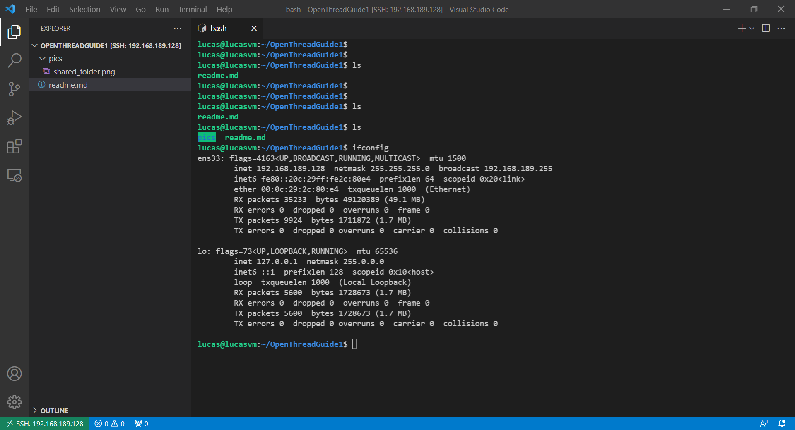

# Thread Introduction

## Environnement : 

- Windows 10
- Ubuntu Server 20.04.3 LTS in
    - VMware player (usb passthrough required)
    - user/password : `lucas` / `lucas`
- Using VS Code for remote developpement in the VM.

## Hardware

- Nordic semiconductor [nrf9160dk](https://www.nordicsemi.com/Products/Development-hardware/nrf9160-dk) (using nrf9160dk_nrf52840)
    - `SN=960050029`
- 3x Nordic semiconductor [nrf52840dk](https://www.nordicsemi.com/Products/Development-hardware/nRF52840-DK) (using nrf52840dk_nrf52840)
    - 1x rev A (0.9.2 / 2017.26) :
        - `SN=683095696`
    - 2x rev C (2.0.1 / 2021.10) :
        - `SN=683624946`
        - `SN=683339521`


## Sources

### First readings

- threadgroup : 
    - [THREAD, MATTER, AND CHIP – THIS GLOSSARY WILL QUICKLY BRING YOU UP TO SPEED](https://www.threadgroup.org/news-events/blog/ID/287/Thread-Matter-And-CHIP--This-Glossary-Will-Quickly-Bring-You-Up-To-Speed#.YUI5W7gzaUl)
    - [Thread 1.1 Specification Request Form](https://www.threadgroup.org/ThreadSpec)
    - [Thread Benefits](https://www.threadgroup.org/What-is-Thread/Thread-Benefits)
    - [Developers](https://www.threadgroup.org/What-is-Thread/Developers)
- Wikipedia : [Thread (network protocol)](https://en.wikipedia.org/wiki/Thread_(network_protocol))
- domotique123.fr : [Thread, nouveau protocole approuvé par Matter (CHIP)](https://www.domotique123.fr/thread-nouveau-protocole-pousse-par-chip/)
- Nordic Semiconductor :
    - [Demo: Thread-powered Smart House with nRF52840](https://www.youtube.com/watch?v=qr_B_dvZego)
    - [Introduction to Matter](https://www.youtube.com/watch?v=v_285vCHifw)
    - [Developing Thread Products using nRF Connect SDK](https://www.youtube.com/watch?v=prZ8r6g4-pI)

### OpenThread
- Website : https://openthread.io/
- GitHub : https://github.com/openthread/openthread
- Guides : https://openthread.io/guides
    - [**DONE**] [Simulating a Thread network using OpenThread in Docker](https://openthread.io/codelabs/openthread-simulation)
    - [**DONE**] [Build a Thread network with nRF52840 boards and OpenThread](https://openthread.io/codelabs/openthread-hardware)
    - [Testing a Thread Network with Visualization](https://openthread.io/codelabs/openthread-testing-visualization)
    - [**TODO**] [Pre-Built NCP Firmware](https://openthread.io/platforms/co-processor/firmware)
    - [**TODO**] [Packet Sniffing with Pyspinel](https://openthread.io/guides/pyspinel/sniffer)
- Porting OpenThread to new hardware : https://openthread.io/guides/porting
- [OpenThread BorderRouter Posix](https://github.com/openthread/ot-br-posix)
- Documentation :
    - [IPv6 Addressing](https://openthread.io/guides/thread-primer/ipv6-addressing.md#unicast-address-types)
    - [Node Roles and Types](https://openthread.io/guides/thread-primer/node-roles-and-types)
    - [7. Create the Thread network](https://openthread.io/codelabs/openthread-hardware#6)
    - [Build OpenThread](https://openthread.io/guides/build/index.md)
    - [OpenThread Daemon](https://openthread.io/platforms/co-processor/ot-daemon)
- [**OpenThread CLI Reference**](https://github.com/openthread/openthread/blob/main/src/cli/README.md)
    - [OpenThread CLI - Commissioner](https://github.com/openthread/openthread/blob/main/src/cli/README_COMMISSIONER.md)
    - [OpenThread CLI - Joiner](https://github.com/openthread/openthread/blob/main/src/cli/README_JOINER.md)
    - [OpenThread CLI - Commissioning](https://github.com/openthread/openthread/blob/main/src/cli/README_COMMISSIONING.md)
    - [OpenThread CLI - UDP Example](https://github.com/openthread/openthread/blob/main/src/cli/README_UDP.md)


### Zephyr RTOS
- [Thread protocol](https://docs.zephyrproject.org/latest/reference/networking/thread.html)

---

# Zephyr RTOS nrf52840 developpment

## 1. Install

[Getting Started Guide](https://docs.zephyrproject.org/latest/getting_started/index.html)
- install python venv, install requirements `python3 -m install -r ./zephyr/scripts/requirements.txt`

## 2. General building commands

```
source .venv/Scripts/activate
export ZEPHYR_TOOLCHAIN_VARIANT=gnuarmemb
export GNUARMEMB_TOOLCHAIN_PATH="C:\Users\ldade\.platformio\packages\toolchain-gccarmnoneeabi"
```

## 3. Getting started with bluetooth

1. Examples :
- https://docs.zephyrproject.org/latest/samples/bluetooth/peripheral_hr/README.html
- https://docs.zephyrproject.org/latest/samples/bluetooth/central_hr/README.html

2. Building commands :

```
west build -b nrf9160dk_nrf52840 -d central_hr/build central_hr -- -DCONF_FILE="prj.conf"
west flash -d central_hr/build -r nrfjprog --snr 960050029

west build -b nrf52840dk_nrf52840 -d peripheral_hr/build peripheral_hr -- -DCONF_FILE="prj.conf" 
west flash -d peripheral_hr/build -r nrfjprog --snr 683095696
```

## 4. OpenThread CLI firmware for nrf9160dk_nrf52840

Custom samples (copy) :

### nrf9160dk_nrf52840 sample

- [cli91](./cli91) for nrf9160dk_nrf52840

```
west build -b nrf9160dk_nrf52840 -d cli91/build cli91 -- -DCONF_FILE="prj.conf overlay-ot.conf"
west flash -d cli91/build -r nrfjprog --snr 960050029 --erase
```


### nrf9160dk_nrf52840 sample

- [cli52](./cli52) for nrf52840dk_nrf52840

```
west build -b nrf52840dk_nrf52840 -d cli52/build cli52 -- -DCONF_FILE="prj.conf overlay-ot.conf"
west flash -d cli52/build -r nrfjprog --snr 683095696 --erase
```

---

# OpenThread network demo

- Following this guide : [Build a Thread network with nRF52840 boards and OpenThread](https://openthread.io/codelabs/openthread-hardware)
- Using a `nrf9160dk` instead of a `nrf52840dk`

## Results

I succeeded to form a Thread networks with 3 devices :
- one `nrf52840dk_nrf52840` working as a *RCP* for a Linux Virtual machine.
- one `nrf52840dk_nrf52840` working as a *FTD*.
- one `nrf9160dk_nrf52840` working as a *FTD*.

## Screenshots

Ping between two devices : 


UDP packets between two devices :


---

## Other

- The reason why nrf24L01 cannot work with Thread : https://electronics.stackexchange.com/questions/199008/can-nrf24l01-use-ieee-802-15-4-and-6lowpan-protocol 
- Nordic Semis World :
    - nRF Connect for VS Code:
        - https://devzone.nordicsemi.com/f/nordic-q-a/79344/nrf-connect-for-vs-code/328443
        - https://www.rajeevpiyare.com/posts/nrfconnect-vs-code/
        - https://developer.nordicsemi.com/nRF_Connect_SDK/doc/latest/nrf/getting_started.html
        - https://nordicplayground.github.io/vscode-nrf-connect/
        - https://www.youtube.com/watch?v=r2_W8rInr38&list=PLx_tBuQ_KSqEt7NK-H7Lu78lT2OijwIMl&index=1
    - Nordic issues about `Thread` : https://devzone.nordicsemi.com/search?q=thread
    - [Lightning application example on nrf52840](https://github.com/project-chip/connectedhomeip/tree/master/examples/lighting-app/nrfconnect)
    - [nRF Thread Topology Monitor](https://infocenter.nordicsemi.com/index.jsp?topic=%2Fcom.nordic.infocenter.threadsdk.v0.9.0%2Fthread_topology_monitor.html)
    - [Getting Started with Thread](https://infocenter.nordicsemi.com/index.jsp?topic=%2Fcom.nordic.infocenter.threadsdk.v0.8.0%2Fthread_intro.html)
    - [nRF5 SDK for Thread and Zigbee](https://www.nordicsemi.com/Products/Development-software/nRF5-SDK-for-Thread-and-Zigbee/Download#infotabs)
- Linux : Create symlink : `ln -s /mnt/hgfs/OpenThreadGuide1  ~/OpenThreadGuide1`

## Know issues :
- nrf52840dk `683095696` Board is very old "RevA" and has problems regarding the USB : https://github.com/openthread/openthread/issues/3681
    - build using `script/build nrf52840 UART_trans -DOT_JOINER=ON -DOT_COMMISSIONER=ON` instead of `script/build nrf52840 USB_trans -DOT_JOINER=ON -DOT_COMMISSIONER=ON`
    - Moreover, I failed to make it work with `cli52` OpenThread CLI firmware for unkown reason :
        - crashing during `ot factoryreset`
        - blocked during `ot scan`

Host logs related to the USB problem :

```
pi@raspberrypi:~ $ sudo dmesg -T -c
[mer. sept. 15 16:43:35 2021] usb 1-1.3: device descriptor read/64, error -110
[mer. sept. 15 16:43:35 2021] usb 1-1-port3: attempt power cycle
[mer. sept. 15 16:43:36 2021] usb 1-1.3: new full-speed USB device number 12 using dwc_otg
[mer. sept. 15 16:43:41 2021] usb 1-1.3: device descriptor read/8, error -110
[mer. sept. 15 16:43:46 2021] usb 1-1.3: device descriptor read/8, error -110
[mer. sept. 15 16:43:46 2021] usb 1-1.3: new full-speed USB device number 13 using dwc_otg
[mer. sept. 15 16:43:51 2021] usb 1-1.3: device descriptor read/8, error -110
```

- If shared folder isn't mounted on the VM (VMware player) :
    - Execute command in VM on statup : ``sudo vmhgfs-fuse .host:/ /mnt/hgfs/ -o allow_other -o uid=1000``
    - see : https://askubuntu.com/questions/74825/why-dont-shared-files-show-up-in-hgfs
- VM Linux : Don't extract tar archive into shared directory
- Download and install [GNU Arm Embedded Toolchain](https://askubuntu.com/questions/1243252/how-to-install-arm-none-eabi-gdb-on-ubuntu-20-04-lts-focal-fossa) on linux.

## Illustration :


